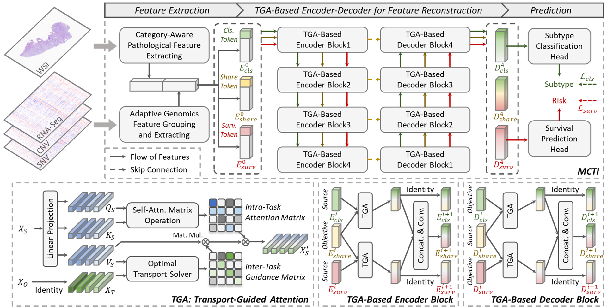

# MCTI

  <b>Multimodal Cross-Task Interaction for Survival Analysis in Whole Slide Pathological Images</b>, MICCAI 2024.

**Summary:** Here is the official implementation of the paper "Multimodal Cross-Task Interaction for Survival Analysis in Whole Slide Pathological Images".

